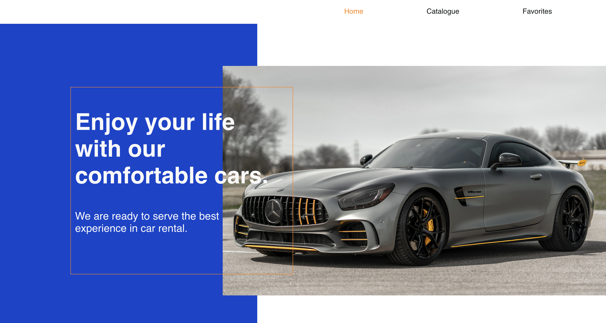

# 🚗 Car Rental

A React-based **car rental application** that allows users to browse cars, apply filters, and save favorites.  
Built as a **pet project** to practice modern React ecosystem, API integration, and state management.

🔗 **Live Demo:** [Car Rental App](https://pylypchukroman.github.io/car-rent/)  
📸 **Screenshots** – see below

---

## ✨ Features

- **Main Page** – entry point with general service info.
- **Catalog** – browse available cars, view details, and filter by brand, price, or mileage.
- **Favorites** – save cars you’re interested in for quick access later.

---

## 🛠️ Technologies Used

- **React** – core library
- **React Router** – routing
- **Axios** – API requests
- **Redux Persist** – persisting state
- **Notiflix** – notifications
- **React Lazy Load Image** – image optimization
- **React Loader Spinner** – loading indicators

---

## 🚀 Installation & Setup

1. Clone this repository:
   ```bash
   git clone https://github.com/your-username/car-rental.git
   
2. Navigate to the project folder:
   ```bash
   cd car-rental

3. Install dependencies:
   ```bash
   npm install

4. Run the app:
   ```bash
   npm start

5. Open http://localhost:3000 in your browser.

## 📝 Future Improvements

1. Add authentication & user accounts
2. Booking system with rental dates

## 📸 Screenshots

### Home Page


### Catalog


### Favorites

