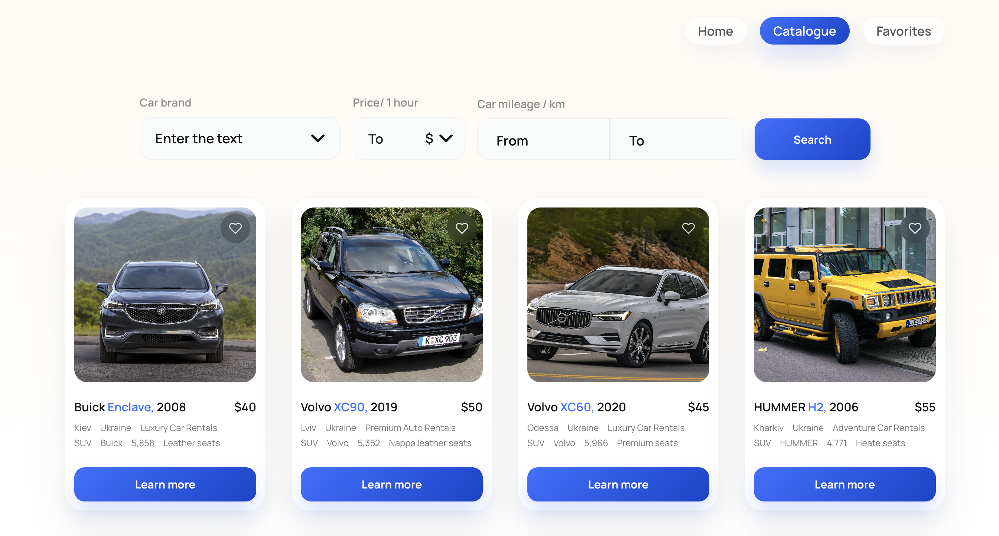
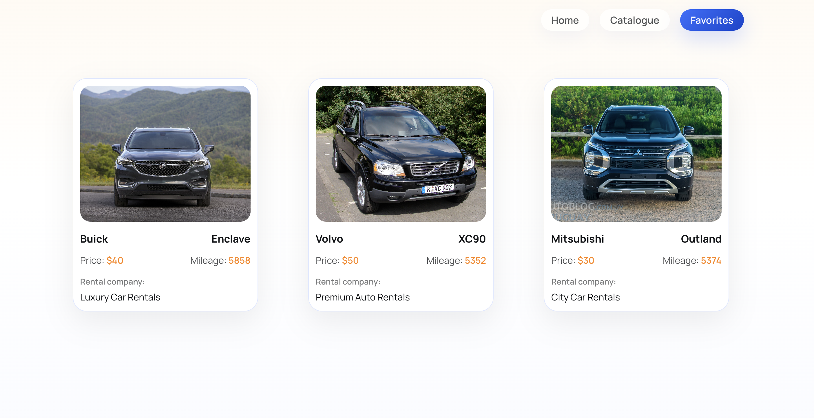

# 🚗 CarRent

CarRent is a responsive React car rental app for browsing available vehicles,
filtering by brand, price, and mileage, viewing detailed car information, and
saving favorites.

🔗 **Live Demo:** [CarRent](https://pylypchukroman.github.io/car-rent/)

## ✨ Features

- **Responsive landing page** with modern hero, about, and stats sections.
- **Car catalog** with filtering by brand, hourly price, and mileage range.
- **Car details modal** with rental conditions, accessories, and contact action.
- **Favorites page** with persisted favorite cars.
- **Mobile and tablet layouts** optimized for filters, cards, empty states, and footer.
- **Lazy-loaded images** and loading/error states.

## 🛠️ Tech Stack

- **React 18**
- **React Router**
- **Redux Toolkit**
- **Redux Persist**
- **Axios**
- **SCSS Modules / Sass**
- **Notiflix**
- **React Lazy Load Image Component**
- **React Loader Spinner**

## 🚀 Getting Started

1. Clone the repository:

   ```bash
   git clone https://github.com/pylypchukroman/car-rent.git
   ```

2. Open the project folder:

   ```bash
   cd car-rent
   ```

3. Install dependencies:

   ```bash
   npm install
   ```

4. Start the development server:

   ```bash
   npm start
   ```

5. Open the app in your browser:

   ```text
   http://localhost:3000/car-rent
   ```

## 📦 Available Scripts

- `npm start` - run the app locally.
- `npm run build` - create a production build.
- `npm test` - run tests.
- `npm run deploy` - deploy the build to GitHub Pages.

## 📸 Screenshots

### Home Page


### Catalog



### Favorites


